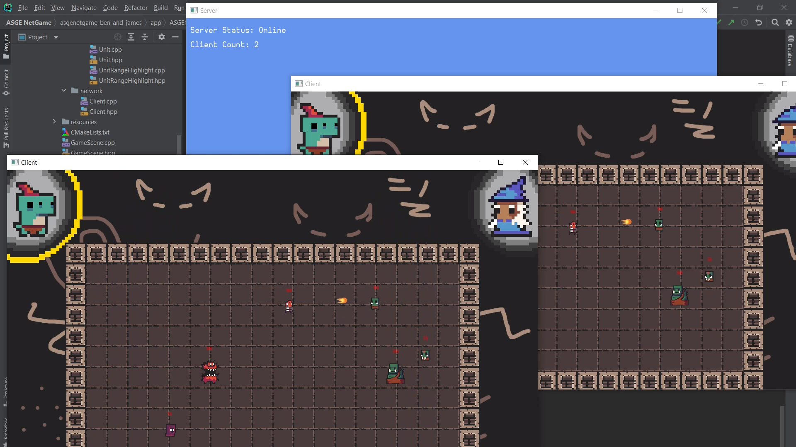

# TCP Network Game created in C++ with ASGE and the Kissnet library

A small multiplayer game made for the year two module More Games in C++. Includes my custom wrapper built around the ASGE engine!  

Gameplay Video: https://youtu.be/i5RK8R9Vjr0 &nbsp;- See the game in action! 
Deep Dive Video: https://youtu.be/C_-GhLI7oos - My thought process behind the code
